<!-- ═══════════════════════════════════════════ HEADER ══════════════════════════════════════════ -->


<!-- ══════════════════════════════════════ ANIMATED ROLES ════════════════════════════════════════ -->
<p align="center">
  
</p>

<!-- ════════════════════════════════════════ BADGES ══════════════════════════════════════════════ -->
<p align="center">
  
  
  
</p>

<br/>

<!-- ═══════════════════════════════════════ ABOUT ME ════════════════════════════════════════════ -->
<table align="center" border="0" width="90%">
<tr>
<td>

```
╔══════════════════════════════════════════════════════════════════════╗
║  > cat about_me.txt                                                  ║
║                                                                      ║
║  🔭  Working on   →  SimChart NG & SCMO @ Elsevier                   ║
║  🏗️  Role         →  SME (SimChart) · Delegate Architect (SCMO)      ║
║  🌱  Learning     →  Python · Pydantic · Generative AI / LLMs        ║
║  ⚡  Superpower   →  Architecting systems that scale & endure        ║
║  💬  Ask me about →  .NET · Spring Boot · Azure · System Design      ║
╚══════════════════════════════════════════════════════════════════════╝
```

</td>
</tr>
</table>

<br/>

<!-- ═══════════════════════════════════════ TECH STACK ══════════════════════════════════════════ -->
<h2 align="center">⚡ TECH ARSENAL</h2>

<h4 align="center">Languages</h4>
<p align="center">
  
</p>

<h4 align="center">Frameworks & Runtimes</h4>
<p align="center">
  
</p>

<h4 align="center">Databases</h4>
<p align="center">
  
  &nbsp;
  
</p>

<h4 align="center">Cloud & DevOps</h4>
<p align="center">
  
</p>

<br/>

<!-- ═══════════════════════════════════════ LEARNING ════════════════════════════════════════════ -->
<h2 align="center">🧠 LEARNING RADAR</h2>
<p align="center">
  
  &nbsp;&nbsp;
  
  
  
  
</p>

<br/>

<!-- ═══════════════════════════════════════ STATS ═══════════════════════════════════════════════ -->
<h2 align="center">📊 STATS DASHBOARD</h2>

<p align="center">
  
  &nbsp;
  
</p>

<!-- ═══════════════════════════════════════ STREAK ══════════════════════════════════════════════ -->
<p align="center">
  
</p>

<!-- ═══════════════════════════════ CONTRIBUTION SNAKE ════════════════════════════════════════════ -->
<!-- Generated by GitHub Action (.github/workflows/snake.yml) — reads full graph incl. private org commits -->
<p align="center">
  
</p>

<br/>

<!-- ═══════════════════════════════════════ FOOTER ══════════════════════════════════════════════ -->

